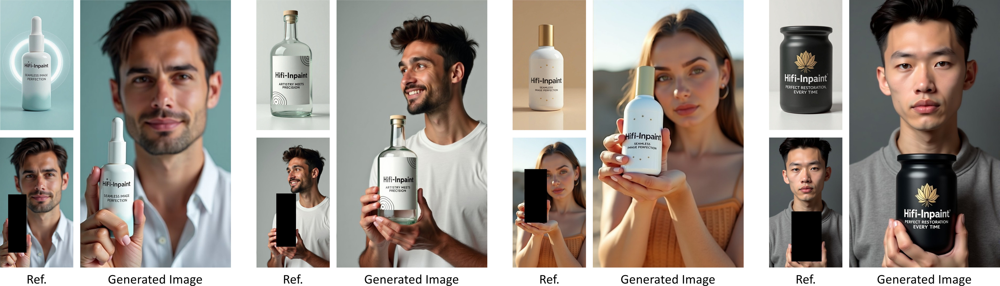
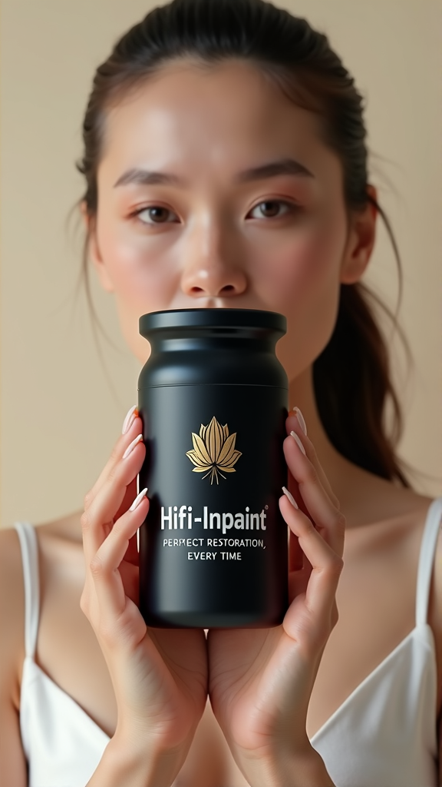
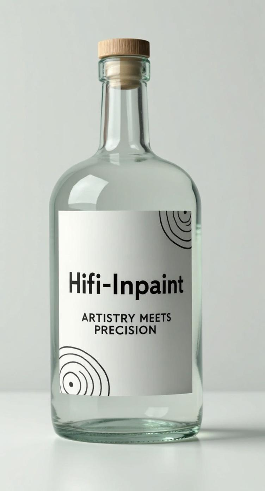

# HiFi-Inpaint

<p align="center">
  
</p>

Official implementation of **HiFi-Inpaint** (CVPR 2026).

## Demo Results

| Reference | Condition (Masked) | Result |
|:---------:|:-----------------:|:------:|
|  |  |  |
|  |  |  |

## Installation

```bash
pip install -r requirements.txt
```

## Inference

1. Download the base model [FLUX.1-dev](https://huggingface.co/black-forest-labs/FLUX.1-dev) and our [LoRA weights](https://www.modelscope.cn/asdfasgad/hifi_inpaint_released.git).

2. Update the paths in `scripts/run_inference.sh`:
   - `FLUX_PATH`: path to FLUX.1-dev
   - `LORA_PATH`: path to LoRA checkpoint

3. Run inference:
```bash
bash scripts/run_inference.sh
```

Results will be saved to `./output/`.

## Training

See `train/` directory for training scripts and configs.

```bash
bash train/scripts/train.sh
```

## License

This project is licensed under the Apache License 2.0 - see the [LICENSE](LICENSE) file for details.
